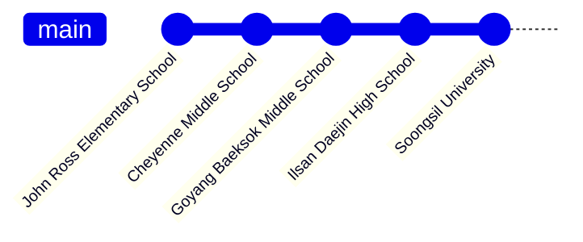

## I'm an Integrated Engineer who loves to develop my own ideas 🤔
 ### My Interests are.. 📌
 > **`🔍 ML/DL`** **`📈 Data Science`** **`☁️ Cloud Computing`** **`📟 Embedded SW`** **`🤖 Robotics`** **`🏗 3D Modeling`**

## Work Experience 👓
  👨‍💻 [Syncorbis Inc.](https://syncorbis.com/) (2020.10.29. ~ 2022.01.31.)

  > Sotware Engineer

## Other Career Experience 🔍
  👨‍💼 **[Soongsil University](https://ssu.ac.kr/) [Student Council](http://stu.ssu.ac.kr/) (2022.12.23. ~ )**
  > **Director of Facilities Management**
  
  👨‍💻 **[Soongsil University](https://ssu.ac.kr/) of [Next Generation Semiconductor Innovation Sharing University](https://disu.ac.kr) (2022.11.14. ~ )**
  > **Software Engineer**
  
  👨‍💻 Ilsan Daejin Highschool Mentorship Program [Road to Universe](https://timedream.modoo.at/?link=duthcyv9) (2022.06.26. ~ 2022.07.21)
  > AI/IT Mentor
  
  👨‍💼 [Soongsil University](https://ssu.ac.kr/) [Student Council](http://stu.ssu.ac.kr/) (2021.11.27. ~ 2022.12.02.)
  > Student Representative of [AI Convergence](https://aix.ssu.ac.kr/main)
  
  👨‍💼 [Ilsan Daejin High School](https://isdj.hs.kr/) (2019.08.24. ~ 2021.02.28.)
  > 3-7 Class President
  
  🎻 [Goyang Youth Orchestra](http://www.gyyouthorchestra.com/orchestra/) (2017.02.18. ~ 2019.04.07.)
  > 2nd Violinist
  
  👨‍💼 현세 Robotics Club (2019.03.04. ~ 2020.03.01.)
  > Vice President
  
  👨‍💼 [Cheyenne Middle School TSA(Technology Student Association)](https://cheyenne.edmondschools.net/our-school/clubs/tsa/) (2015.09.22. ~ 2016.05.18.)
  > President
  
  🎻 2015-2016 [North Central Honor Orchestra](https://cheyenne.edmondschools.net/2015/10/05/ncho2015/) 
  > 2nd Violinist
  
  🎻 Cheyenne Middle School Orchestra (2014.08.28. ~ 2016.05.20.)
  > Violinist
  
  🗂️ 2014-2015 [Cheyenne Middle School Academic Team](https://cheyenne.edmondschools.net/our-school/clubs/academic-team/)
  >

## Education and Training ✍️

   📖 **Studying in [Soongsil University](https://ssu.ac.kr/) since 2021.**
   > **Major: [AI Convergence](http://aix.ssu.ac.kr/main)**  
   > **Intensive Major: [Next Generation Semiconductor(System SW)](https://semicon.disu.ac.kr/)**  
   > **Convergence Major: Artificial Intelligence Semiconductor, Artificial Intelligence Mobility, [Startup Convergence](https://startup.ssu.ac.kr/)**

   ✔️ Completed [Soongsil University FLEX MATH Startup Academy](http://www.funmath.net/) in 2023.
   >
   
   ✔️ Completed [Soongsil University Edu-Up Academy](https://startupclass.kr/) in 2021.
   >
   
   ✔️ Completed [2021 iGEM VCL(Venture Creation Labs)](https://blog.igem.org/blog/2021/5/15/the-igem-epic-2021-venture-creation-labs).
   >
			
   🎓 Graduated [Ilsan Daejin High School](https://isdj.hs.kr/) in 2021.
   > SW Education Course of Science-Technology Convergence
			
   ✔️ Completed [KAIST Cyber Education Course for Gifted Student](https://talented.kaist.ac.kr:8443/) in 2nd Semester of 2019.
   > IoT(Internet of Things) Course
			
   🎓 Graduated in [Goyang Baeksok Middle School](http://www.baeksok.ms.kr/) in 2018.
   >
			
   📚 Studied in [Cheyenne Middle School](https://cheyenne.edmondschools.net/) as 6th ~ 7th Grade in 2014.08.28. ~ 2016.05.20.
   >
			
   🎓 Graduated in [John Ross Elementary School](https://johnross.edmondschools.net/) in 2014.
   >

## Club Activities 🚩
  - **`2nd Member`** of **AlgoITSSU** in Soongsil University, AI Convergence
  - **`1st Member`** of **AIX Developer Team** in Soongsil University, AI Convergence
  - **`1st Member`** of **MAKERS** SW Project Club in Soongsil University, AI Convergence
  - **`4th Member`** of **[Kaleido](https://github.com/SSUKaleido)** Game & VR/AR Content Development Club in Soongsil University, College of Information Technology
  - **`39th Member`** of **[SSCC(Soongsil Computing Club)](https://github.com/SoongSilComputingClub)** in Soongsil University
  - **`25th Member`** of **[Synergy](https://instagram.com/ssu_synergy?igshid=YmMyMTA2M2Y=)** Startup Club in Soongsil University
  - **`4th Member`** of **현세** Robotics Club in Ilsan Daejin High School
  - **`1st Member`** of **[TSA(Technology Student Association)](https://cheyenne.edmondschools.net/our-school/clubs/tsa/)** in Cheyenne Middle School

## Abilties ❗
   ### Computer Languages 💻
   
